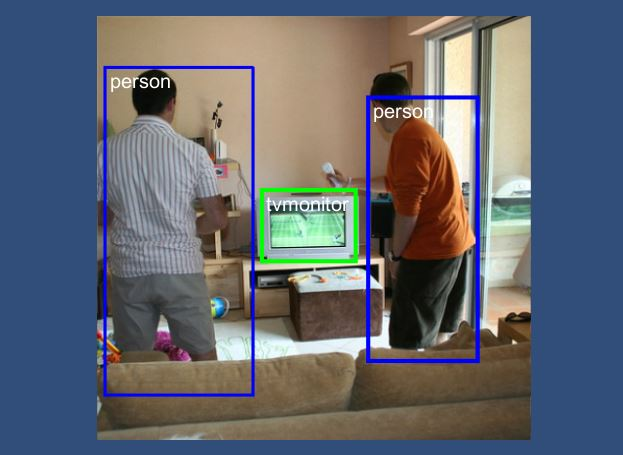
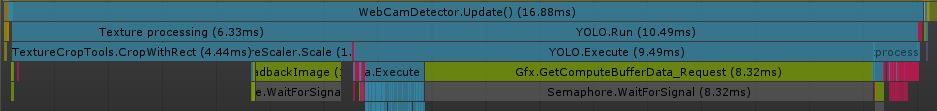

# YOLO-UnityBarracuda
Object detection app build on Unity Barracuda and YOLOv2 Tiny

# About
This project is simple open source project presenting example of use Unity Barracuda. It use lite version of YOLOv2 (v3 is not currently supported). Target platform are mobile devices but you can use it also on other devices. This sample uses camera as input.

  
  
The images was taken from open COCO dataset.

# Dependencies
- [**Unity Barracuda**](https://docs.unity3d.com/Packages/com.unity.barracuda@0.7/manual/index.html) installed by Package Manager (tested on version 0.7.0)
- **YOLOv2 Tiny model** already contained in Assets (taken from [onnx model zoo](https://github.com/onnx/models))

# How to run
***Just open Scenes/SampleScene and run!***

There are only two MonoBehaviour scripts:
- *WebCamDetector.cs* which take texture from camera and run model
- *OnGUICanvasRelativeDrawer.cs* required by previous script to render text

# Performance 
It runs in ~45FPS on my laptop (GTX 1060 Max-Q and i5-7300HQ).
Model on my GPU infereces about 10ms.

