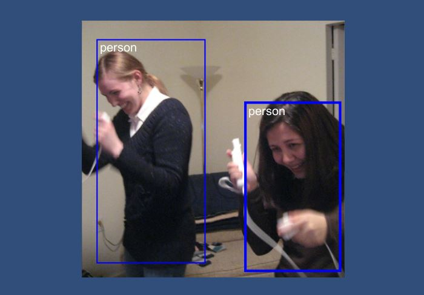

# ❗❗❗ [New YOLOv8 version](https://github.com/wojciechp6/YOLOv8Unity) ❗❗❗
**I'm proudly announcing a new project that implements the state-of-the-art YOLOv8 network! It has <ins>object detection</ins> as well as <ins>instance segmentation</ins> demos.  
[Check it here!](https://github.com/wojciechp6/YOLOv8Unity)**

# YOLO-UnityBarracuda
Object detection app built on Unity Barracuda and YOLOv2 Tiny. This project will not be supported in the future, check the [new version](https://github.com/wojciechp6/YOLOv8Unity).

## About
This simple open-source project presents an example of Unity Barracuda usage. It uses the lite version of YOLOv2. The target platform are mobile devices but it also works fine on desktops. This project uses the webcamera as input.

  
  
The images were taken from the open COCO dataset.

## Dependencies
- [**Unity Barracuda**](https://docs.unity3d.com/Packages/com.unity.barracuda@3.0/manual/GettingStarted.html) installed by Package Manager (tested on version 3.0)
- **YOLOv2 Tiny model** from [onnx model zoo](https://github.com/onnx/models/tree/main/validated/vision/object_detection_segmentation/tiny-yolov2))

## How to run
1. Download and copy YOLOv2 Tiny model to Assets.
2. Open *Scenes/SampleScene*.
3. In the *Main Camera* object select the *WebCamDetector* script and point the downloaded model in *Model File* field.

There are only two MonoBehaviour scripts:
- *WebCamDetector.cs* which takes texture from the camera and runs the model.
- *OnGUICanvasRelativeDrawer.cs* required by the previous script to render text.

